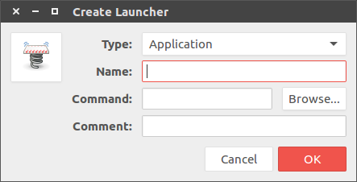
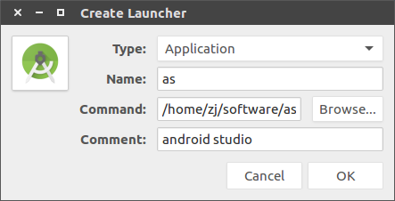

# [Ubuntu]制作启动器

参考：[桌面启动器制作](https://zj-linux-guide.readthedocs.io/zh_CN/latest/tool-use/%E6%A1%8C%E9%9D%A2%E5%90%AF%E5%8A%A8%E5%99%A8%E5%88%B6%E4%BD%9C/)

使用工具`gnome-desktop-item-edit`创建桌面启动器

    $ gnome-desktop-item-edit --create-new ~/Desktop/

输入名字，指定启动脚本`studio.sh`，点击图标指定图片，还可以输入备注

这样在桌面就生成了启动器，点击即可启动`Android Studio`

## 搜索栏设置

将生成的启动器`as.desktop`放置到`~/.local/share/applications`，即可在搜索栏中找到