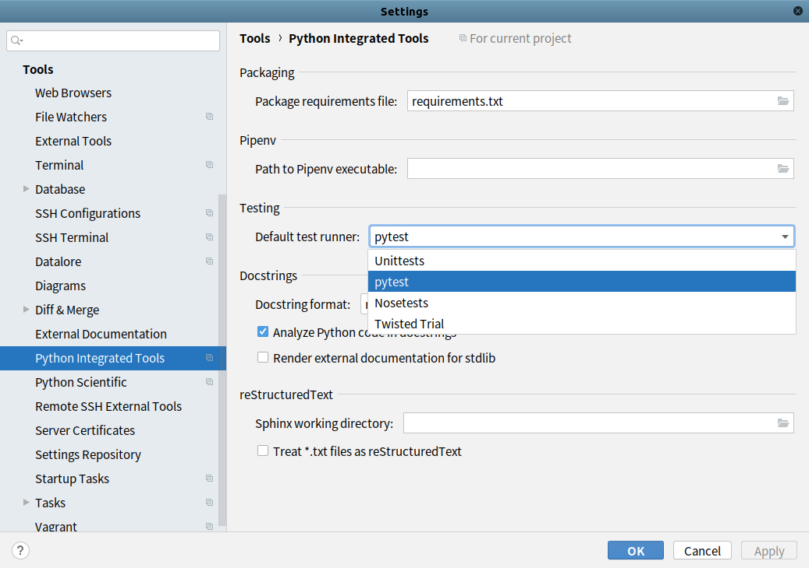
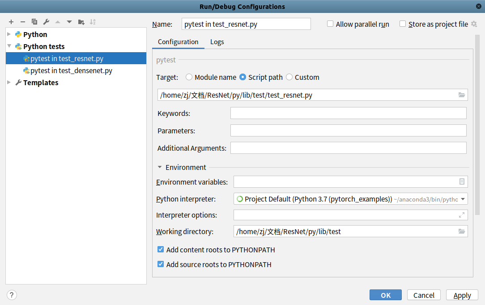

# [PyCharm]pytest设置和使用

`PyTest`使用参考[pytest](https://zj-image-processing.readthedocs.io/zh_CN/latest/python/pytest/)

## 设置

点击`菜单栏 -> File -> Settings`，选择`Tools->Python Integrated Tools`，在`Testing`选项中选择`pytest`

## 使用

编辑测试文件后，在编辑区域右键选择`Run  "pytest for xxx"`

如果不存在，需要额外创建运行配置，点击`Edit Configuration`

点击左上角`+`符号，创建一个新的配置

1. 选择`pytest`作为执行命令
2. 选择要执行的文件路径