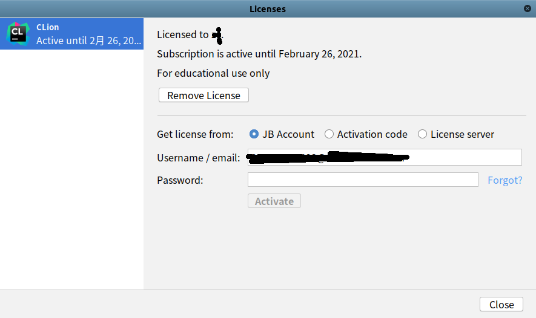

# 学生认证

`JetBrains`提供了学生认证，只需要一个学校邮箱（`.edu.cn`结尾），即可免费使用系列`IDE`

## 认证

1. 登录`JetBrains`官网进行邮箱认证：[JetBrains Products for Learning](https://www.jetbrains.com/shop/eform/students)

2. 填写完认证资料后登录`edu.cn`邮箱进行确认

## 注册

完成邮箱认证后，再次登录`JetBrains`官网进行账户注册：[jetbrains.com/](https://www.jetbrains.com/)

**注意：使用刚才的edu.cn邮箱进行注册**

完成注册后，在本地打开`IDE`，比如`CLion`，点击菜单栏 `-> Help -> Register...`，选择`JB Account`，输入账户名和密码即可进行激活。这样就可以免费使用`JetBrains`全家桶了

## 注意

学生认证仅能维持**一年**的免费使用，需要在**到期前一个星期**进行续期操作；如果错过了这个续期时间，那么将不能再续期了，教育邮箱也无法使用了

## 相关阅读

* [大佬，亲自带你通过教育认证来免费申请JetBrains全家桶...](https://zhuanlan.zhihu.com/p/90353449)
