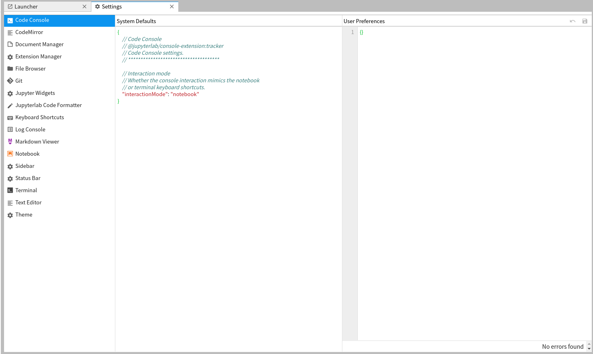
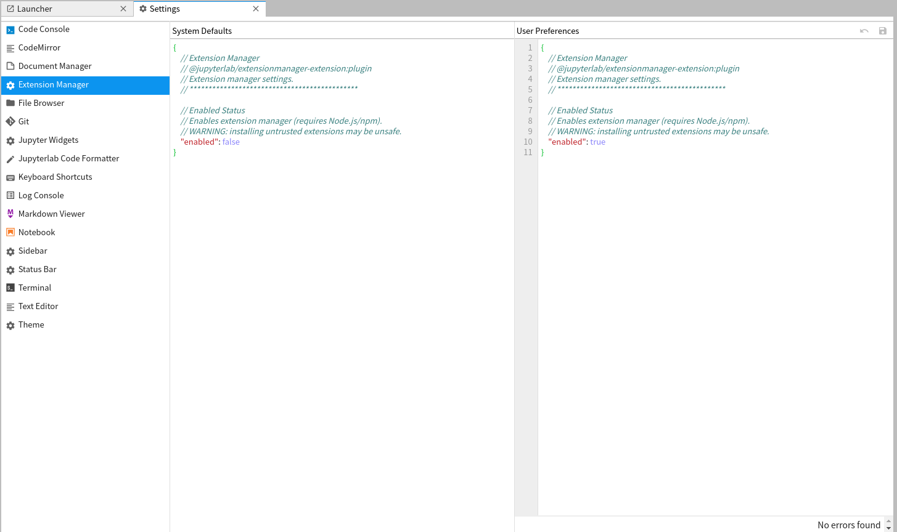
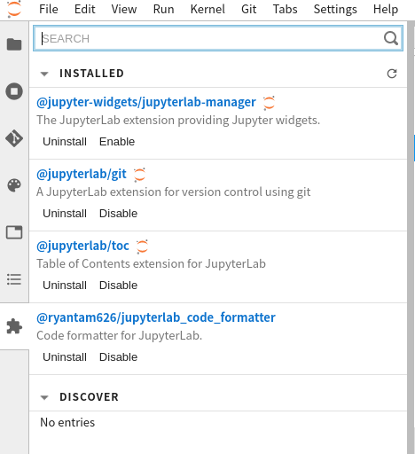

# 基本功能介绍

本章介绍`JupyterLab`常用的基本命令和配置

1. 自动补全
2. 文档查询
3. 快捷键
4. 插件配置

## 自动补全

点击`TAB`键即可

## 文档查询

输入函数或者变量，之后加上`?`即可查询该函数或变量的相关文档

## 快捷键

点击菜单栏`Settings->Advanced Settings Editor`，打开配置页面



选择`Keyboard Shortcuts`即可自定义快捷键

## 插件配置

同样打开配置页面，选择`Extension Manager`，设置属性`enabled`为`true`即可



配置完成后，会在右侧侧边栏显示插件管理器图标，点击该图标后会弹出插件页面，可以查询和管理插件



**注意：插件安装需要`NodeJS`环境**

### 命令行操作

查询已安装插件

```
$ jupyter labextension list
```

更新已安装插件

```
$ jupyter labextension update --all
```

## 相关阅读

* [利器|JupyterLab 数据分析必备IDE完全指南](https://zhuanlan.zhihu.com/p/67959768)
* [JupyterLab 插件合集](http://jupiterd.top/2019/02/01/Jupyterlab-%E6%8F%92%E4%BB%B6%E5%90%88%E9%9B%86.html)