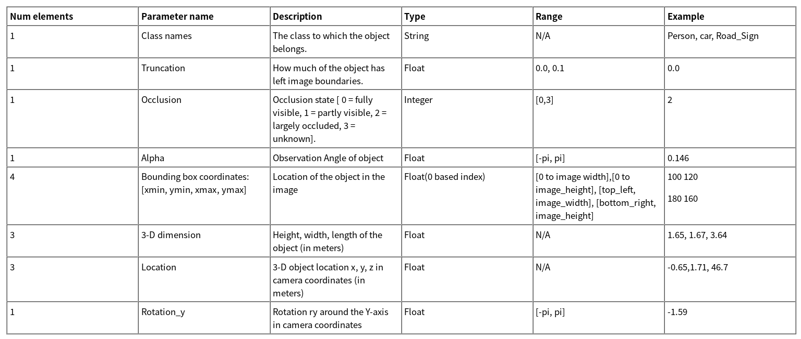
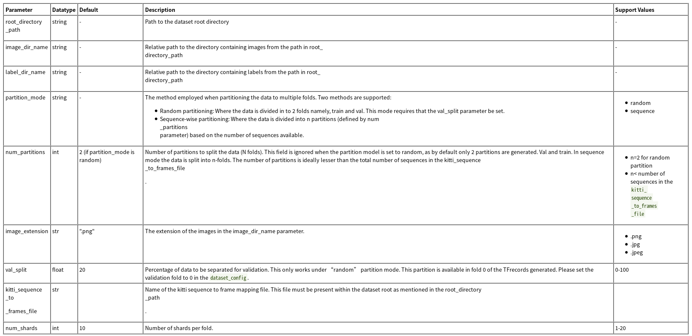

# 准备训练数据

分类任务和检测任务的数据格式和保存方式不同

## 分类数据

分为训练/验证/测试数据，其数据格式如下：

```
|--dataset_root:
    |--train
        |--audi:
            |--1.jpg
            |--2.jpg
        |--bmw:
            |--01.jpg
            |--02.jpg
    |--val
        |--audi:
            |--3.jpg
            |--4.jpg
        |--bmw:
            |--03.jpg
            |--04.jpg
    |--test
        |--audi:
            |--5.jpg
            |--6.jpg
        |--bmw:
            |--05.jpg
            |--06.jpg
```

## 检测数据

以[KITTI数据集](http://www.cvlibs.net/datasets/kitti/eval_object.php?obj_benchmark=2d)的文件格式保存训练数据

```
.
|--dataset root
  |-- images
      |-- 000000.jpg
      |-- 000001.jpg
            .
            .
      |-- xxxxxx.jpg
  |-- labels
      |-- 000000.txt
      |-- 000001.txt
            .
            .
      |-- xxxxxx.txt
  |-- kitti_seq_to_map.json
```

* `images`：保存训练图像的目录
* `labels`：保存标签文件的目录
* `kitti_seq_to_map.json`：可选，暂时不需要

**注意：所有的训练图像应该拥有相同分辨率**

### 标签文件格式

对于`KITTI`格式的标签文件而言，每行表示一个目标，拥有多个字段，其描述如下：



每行共15个元素，示例如下：

```
car 0.00 0 -1.58 587.01 173.33 614.12 200.12 1.65 1.67 3.64 -0.65 1.71 46.70 -1.59
cyclist 0.00 0 -2.46 665.45 160.00 717.93 217.99 1.72 0.47 1.65 2.45 1.35 22.10 -2.35
pedestrian 0.00 2 0.21 423.17 173.67 433.17 224.03 1.60 0.38 0.30 -5.87 1.63 23.11 -0.03
```

其中对于检测任务而言，仅需要目标类别和边界框坐标。设置其余字段为`0`后，示例如下：

```
car 0.00 0 0.00 587.01 173.33 614.12 200.12 0.00 0.00 0.00 0.00 0.00 0.00 0.00
cyclist 0.00 0 0.00 665.45 160.00 717.93 217.99 0.00 0.00 0.00 0.00 0.00 0.00 0.00
pedestrian 0.00 0 0.00 423.17 173.67 433.17 224.03 0.00 0.00 0.00 0.00 0.00 0.00 0.00
```

## TFRecords

对于目标检测任务，需要将`KITTI`格式数据转换成`TFRecords`（`TensorFlow`提供的一种数据格式）。`TLT`提供了转换工具`tlt-dataset-convert`，需要额外的配置文件

### 配置文件

使用`prototxt`格式的配置文件，拥有两个全局参数：

1. `kitti_config`：输入数据设置
      1. `root_directory_path`：数据集根目录路径
      2. `image_dir_name`：相对于`root_directory_path`的路径，表示`图像数据`目录地址
      3. `label_dir_name`：相对于`root_directory_path`的路径，表示`标签数据`目录地址
      4. `partition_mode`：分离数据的方式，共两种
            1. `random`：将数据集随机分离成`train`和`val`两个文件夹，需要`val_split`属性搭配使用
            2. `sequence`：将数据集按顺序分离为`n`个文件夹，需要`num_partitions`属性搭配使用
      5. `num_partitions`：
            1. 当属性`partition_mode`设置为`random`时，忽略该属性
            2. 当属性`partition_mode`设置为`sequence`时，表示分离数据集的个数
      6. `image_extension`：图像扩展名
      7. `val_split`：用于验证集的比例．默认为`20`，表示训练数据和验证数据的比例为`8:2`，仅在`partition_mode=random`生效
      8. `kitti_sequence_to_frames_file`：暂时不需要
      9. `num_shards`：默认为`10`，没理解啥意思
2. `image_directory_path`：数据集根目录路径



### 示例

```
kitti_config {
  root_directory_path: "/workspace/tlt-experiments/data/VOCtrainval_11-May-2012/VOCdevkit/VOC2012"
  image_dir_name: "JPEGImages_kitti/test"
  label_dir_name: "Annotations_kitti/test"
  image_extension: ".jpg"
  partition_mode: "random"
  num_partitions: 2
  val_split: 20
  num_shards: 10
}
image_directory_path: "/workspace/tlt-experiments/data/VOCtrainval_11-May-2012/VOCdevkit/VOC2012"
```

### 转换

```
tlt-dataset-convert [-h] -d DATASET_EXPORT_SPEC -o OUTPUT_FILENAME
                         [-f VALIDATION_FOLD] 
```

* -d：配置文件路径
* -o：输出的`.tfrecords`文件名

实现如下：

```
tlt-dataset-convert -d <path_to_tfrecords_conversion_spec> -o <path_to_output_tfrecords>
```

**注意一：`tlt-dataset-convert`使用小写类名，所以确保`KITTI`格式数据集使用小写类名**