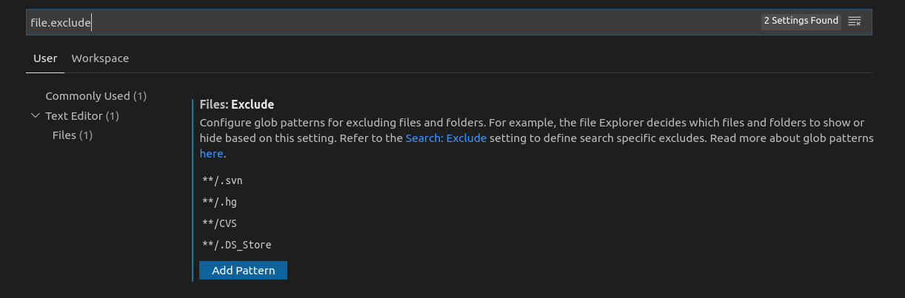

# 显示隐藏文件

参考：[如何在VSCode设置/取消隐藏文件](https://blog.csdn.net/zwkkkk1/article/details/93742821)

* 第一步：使用快捷键`Ctrl+P`打开搜索窗口，输入`>>Preferences: Open Settings`，打开设置窗口
* 第二步：在设置窗口输入`file.exclude`，就可以根据自己需求添加和删除隐藏文件了

