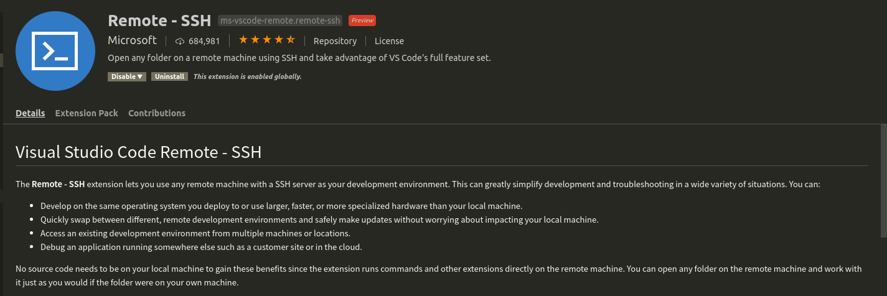

# [SSH]远程服务配置

参考：

[VS Code Remote Development](https://code.visualstudio.com/docs/remote/remote-overview)

[Remote Development using SSH](https://code.visualstudio.com/docs/remote/ssh)

`VSCode`支持远程服务器开发模式，开发过程中的文件均保存在远程，没有在本地备份，所以和`PyCharm`相比更加轻量化

## 安装插件

点击左侧侧边栏` -> Extensions(Ctrl+Shift+X)`，输入`remote`，选择安装插件`Remote - SSH`



安装完成后即可在左侧侧边栏发现`Remote Explorer`，在左下角也存在远程配置图标

## SSH配置和使用

`VSCode`提供了多种方式进行远程连接（`SSH/Container/WSL`），当前使用`SSH`模式，即通过`ssh`进行远程连接

在`~/.ssh/config`文件中新增以下内容（可以点击左下角`remote`图标，选择`Remote-SSH: Open Configuration Files...`打开）

```
Host HOSTNAME
	HostName xxx.xxx.xxx
	User xxx
	Port xxx
	ForwardAgent yes
	StrictHostKeyChecking no
```

指定`HOSTNAME、HostName、User和Port`。`VSCode`会自动读取配置文件，打开左侧侧边栏的图标`Remote Explorer`，在`SSH TARGETS`子窗口下选择刚才的`HOSTNAME`，即可完成连接

## 扩展

实现远程登录后，需要在远程端重新安装插件，可以通过插件窗口安装，也可以在工程配置文件上配置常用的插件

```
"remote.extensionKind": {
    "ms-azuretools.vscode-docker": [ "ui" ],
    "msjsdiag.debugger-for-chrome": [ "workspace" ]
}
```