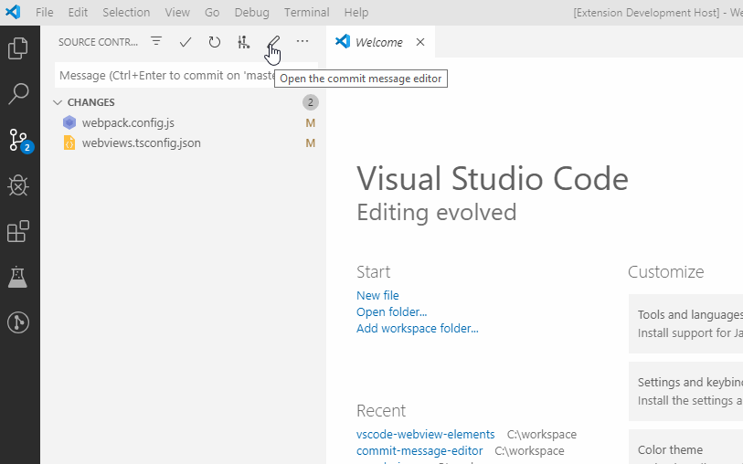

# Commit Message Editor

`Commit Message Editor`提供了格式化提交信息模板

## 安装

在插件库搜索`Commit Message Editor`进行安装

## 操作

提供了两种模式，一个是直接编辑整个提交信息；另一个是使用模板进行编辑

## 相关阅读

* [git commit 提交信息规范入门(配合vscode)](https://blog.csdn.net/weixin_40780243/article/details/108900691)