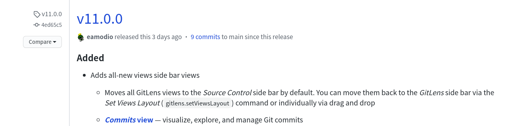

# [GitLens]无法打开

今天突然无法使用`GitLens`在侧边栏的按钮了，当前版本如下：

```
VSCode: v1.51.1
GitLens: v11
```

在网上找到一个参考：[GitLens extension disappeared](https://stackoverflow.com/questions/52575341/gitlens-extension-disappeared/52575990)。估计是因为`GitLens`更新后改变了使用方式

通过查找[eamodio/vscode-gitlens](https://github.com/eamodio/vscode-gitlens/releases)的发布，发现从`v11.0.0`开始`GitLens`侧边栏按钮和`VSCode`源代码管理按钮整合在一起了



## 解决

1. 卸载`GitLens`，然后进入`.vscode/extensions/`，删除`GitLens`缓存

```
rm -rf eamodio.gitlens-11.0.1
```

2. 重新安装`GitLens`，然后点击侧边栏的源代码管理按钮即可进行`GitLens`操作

**Tip：打开源代码管理界面后，点击右上角的`Toggle View Mode`按钮即可切换视图模式，回到熟悉的`GitLens`展示**