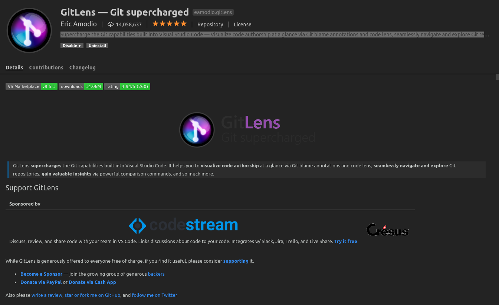
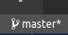
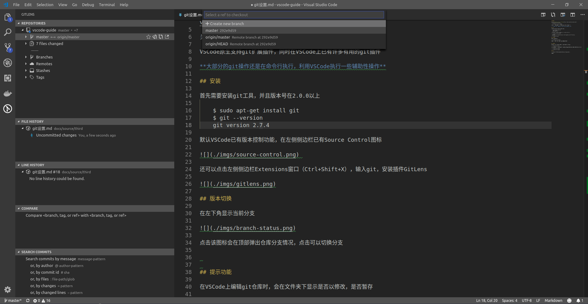
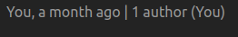
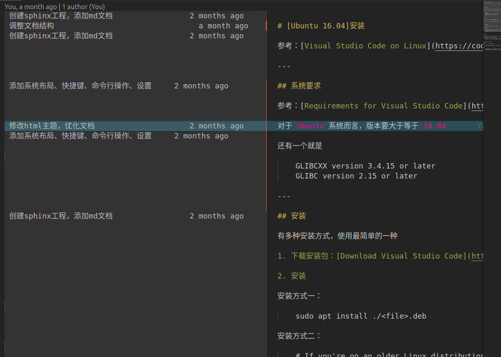
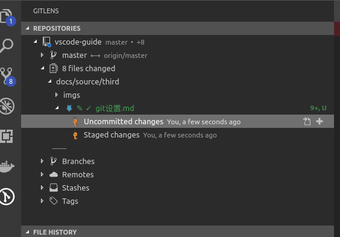
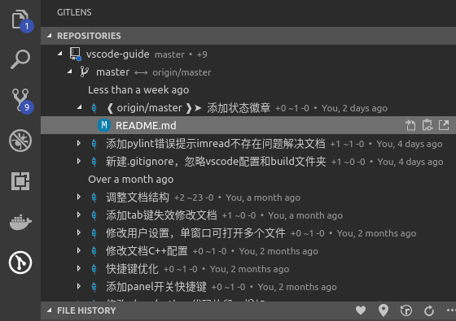
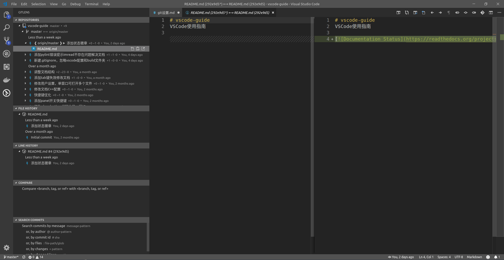

# Git设置

参考：[Using Version Control in VS Code](https://code.visualstudio.com/docs/editor/versioncontrol#_scm-providers)

关键词：`SCM(source control manager)`

`VSCode`原生支持`git`，同时在插件库上已有许多有用的`git`插件

**大部分的`git`操作还是在命令行执行，利用`VSCode`执行一些辅助性操作**

## 安装

首先需要安装`git`工具，并且版本号在`2.0.`0以上

    $ sudo apt-get install git
    $ git --version
    git version 2.7.4

`VSCode`原生版本控制功能，在左侧侧边栏已有`Source Control`图标

 

还可以点击左侧侧边栏`Extensions`窗口（`Ctrl+Shift+X`），输入`git`，安装插件`GitLens`

## 版本切换

在左下角显示当前分支

点击该图标会在顶部弹出仓库分支情况，点击可以切换分支

## 提示功能

在`VSCode`上编辑`git`仓库时，会在文件夹下显示是否以修改，是否暂存

`GitLens`也能在已纳入版本控制的文件顶部显示最新修改时间，以及修改作者，点击还能弹出当前文章修改记录

## `diff`

这个功能估计是最实用的，操作简单，比使用`git diff`工具方便很多

### 查看未提交改变

点击左侧`GitLens`状态，点击已改变的文件状态选项，选择未提交的改变(`Uncommited changes`)，即在右侧编辑框弹出未提交内容

### 查看已提交改变

点击分支(`master`)，显示已提交历史；点击某一次提交，显示修改的文件；点击文件，在右侧编辑框弹出修改比较

