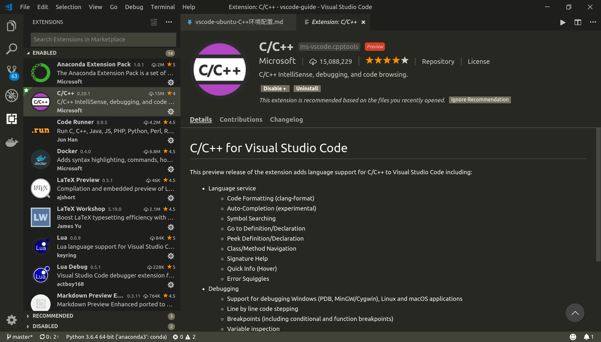
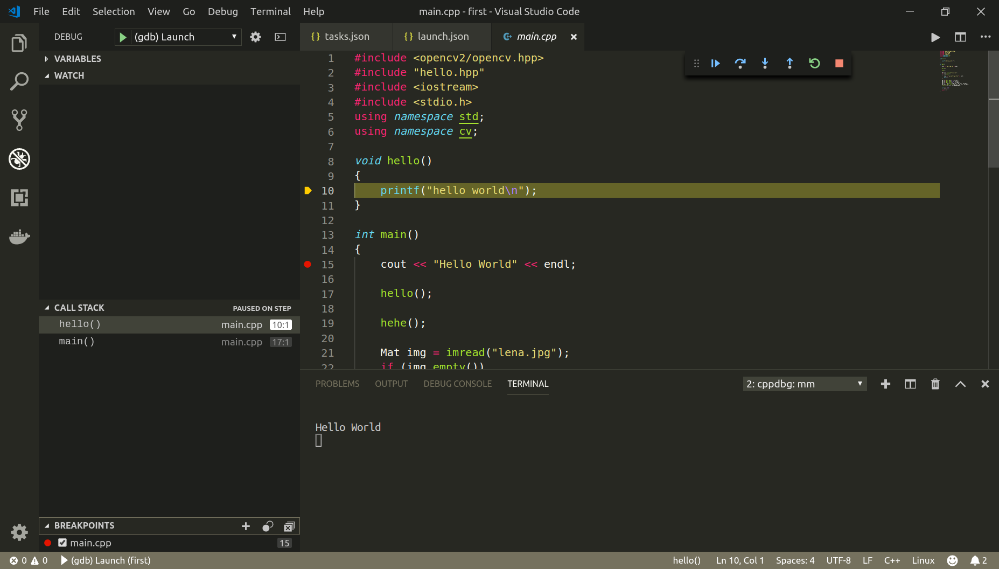

# C++环境配置

参考：

[C/C++ for Visual Studio Code (Preview)](https://code.visualstudio.com/docs/languages/cpp)

[Microsoft/vscode-cpptools](https://github.com/Microsoft/vscode-cpptools)

---

## 安装`C/C++`扩展组件

`VSCode`提供了`C/C++`扩展组件，它提供了基础的功能

* 打开`VSCode`
* 点击左侧活动栏扩展视图按钮
* 输入`c++`
* 点击安装(`install`)，然后重载(`reload`)

注意：该扩展并不包括编译器和调试器，所以需要额外安装编译器和调试器

编译器

    对于Linux，安装GCC

    对于Windows，安装mingw-w64

调试器

    安装gdb或lldb

---

## 智能感知和自动完成

参考：

[Configuring IntelliSense](https://code.visualstudio.com/docs/languages/cpp#_configuring-intellisense)

[Configuring includePath for better IntelliSense results](https://github.com/Microsoft/vscode-cpptools/blob/master/Documentation/Getting%20started%20with%20IntelliSense%20configuration.md)

安装完组件后，就可以进行`C++`编程了，最重要的是它能够提供智能感知和自动完成功能，让你快速编程

但有些时候，你引用的头文件/源文件不在当前工作空间内，此时无法实现智能感知和自动完成，需要进一步进行配置

打开命令窗口(`Ctrl+Shift+P`)，输入`C/Cpp:Edit configurations`，将会在`.vscode`文件夹内生成`c_cpp_properties.json`文件

    {
        "configurations": [
            {
                "name": "Linux",
                "includePath": [
                    "${workspaceFolder}/**"
                ],
                "defines": [],
                "compilerPath": "/usr/bin/gcc",
                "cStandard": "c11",
                "cppStandard": "c++17",
                "intelliSenseMode": "clang-x64"
            }
        ],
        "version": 4
    }

主要修改的部分在`"includePath"`属性，在其中添加你要使用的源文件目录的路径，其中`/**`表示递归搜索该文件夹

其所有属性参考：[c_cpp_properties.json Reference Guide](https://github.com/Microsoft/vscode-cpptools/blob/master/Documentation/LanguageServer/c_cpp_properties.json.md)

---

## 构建代码

参考：

[Building your code](https://code.visualstudio.com/docs/languages/cpp#_building-your-code)

[Custom tasks](https://code.visualstudio.com/docs/editor/tasks#_custom-tasks)

完成编程后，就可以构建代码，此时还需要配置构建命令和参数

* 打开命令窗口(`Ctrl+Shift+P`)
* 输入`Tasks: Configure Task`
* 点击`Create tasks.json file from templates`
* 点击`Others`
* 将会在`.vscode`文件夹内生成`tasks.json`文件

        {
            // See https://go.microsoft.com/fwlink/?LinkId=733558
            // for the documentation about the tasks.json format
            "version": "2.0.0",
            "tasks": [
                {
                    "label": "echo",
                    "type": "shell",
                    "command": "echo Hello"
                }
            ]
        }

属性`label`是用户界面中使用的任务标签

属性`type`表示任务类型，`shell`表示在命令窗口执行

属性`command`表示要执行的实际命令

修改后的`tasks.json`文件如下：

    {
        // See https://go.microsoft.com/fwlink/?LinkId=733558
        // for the documentation about the tasks.json format
        "version": "2.0.0",
        "tasks": [
            {
                "label": "echo-build",
                "type": "shell",
                "command": "echo Hello",
                "group": {
                    "kind": "build",
                    "isDefault": true
                }
            },
            {
                "label": "echo-test",
                "type": "shell",
                "command": "echo Hello",
                "group": {
                    "kind": "test",
                    "isDefault": true
                }
            }
        ]
    }

1. 一个工作空间可以配置多个不同的组，以`"label"`进行区分

2. 如果想要使用`VSCode`构建命令`Tasks: Run Build Task (Ctrl+Shift+B)`或`Tasks: Run Build Task`，那么还需要加入属性`"group"`，属性`”group“`的作用是定义该任务属于哪个组，有`"build"`和`"test"`两种，功能上没有区别

### 额外组件

参考：[VSCode的多个（C/C++）源文件的编译运行(Linux)](https://blog.csdn.net/qq_34347375/article/details/81137962)

扩展组件[Code Runner](https://marketplace.visualstudio.com/items?itemName=formulahendry.code-runner)可以不依靠VSCode编译命令

安装好`Code Runner`后，打开用户设置，找到编译命令设置

    // Set the executor of each language.
    "code-runner.executorMap": {
        ...
        ...
        "c": "cd $dir && gcc $fileName -o $fileNameWithoutExt && $dir$fileNameWithoutExt",
        "cpp": "cd $dir && g++ $fileName -o $fileNameWithoutExt && $dir$fileNameWithoutExt",
        ...
        ...
    }

可以发现其编译命令，可以修改这里使用其他编译命令，包括使用编译文件`Makefile`或者`CMakeLists.txt`

另外设置在终端运行：

    // Whether to run code in Integrated Terminal.
    "code-runner.runInTerminal": false

设置完成后，使用快捷键`Ctrl+Alt+N`或者点击编辑窗口的运行图标即可在内置命令行窗口运行

---

## 调试

参考：[Debugging your code](https://code.visualstudio.com/docs/languages/cpp#_debugging-your-code)

参与调试的编译文件需要在编译命令中加入`-g`选项

修改配置文件

* 点击左侧活动条的调试图标
* 点击配置(`Configure`)图标（*就是那个轴承图标*）
* 选择`C++ (GDB/LLDB)`
* 在`.vscode`文件夹内生成`launch.json`文件

        {
            // Use IntelliSense to learn about possible attributes.
            // Hover to view descriptions of existing attributes.
            // For more information, visit: https://go.microsoft.com/fwlink/?linkid=830387
            "version": "0.2.0",
            "configurations": [
                {
                    "name": "(gdb) Launch",
                    "type": "cppdbg",
                    "request": "launch",
                    "program": "enter program name, for example ${workspaceFolder}/a.out",
                    "args": [],
                    "stopAtEntry": false,
                    "cwd": "${workspaceFolder}",
                    "environment": [],
                    "externalConsole": true,
                    "MIMode": "gdb",
                    "setupCommands": [
                        {
                            "description": "Enable pretty-printing for gdb",
                            "text": "-enable-pretty-printing",
                            "ignoreFailures": true
                        }
                    ]
                }
            ]
        }

属性介绍：[Configuring launch.json for C/C++ debugging](https://github.com/Microsoft/vscode-cpptools/blob/master/launch.md)

需要修改的地方是属性`program`，输入生成的可执行程序或者编译文件

如果需要提前输入参数，修改属性`args`的值

然后在源文件中设置断点，在左侧活动条的调试窗口点击`Start Debugging`图标

### NullReferenceException

参考：[Simple GDB C++ debugging on VS Code fails with a NullReferenceException](https://stackoverflow.com/questions/53921413/simple-gdb-c-debugging-on-vs-code-fails-with-a-nullreferenceexception)

点击调试后，在调试控制台输出异常

    Stopping due to fatal error: NullReferenceException: Object reference not set to an instance of an object

需要设置属性`externalConsole`为`false`

---

## 示例

参考：[vscode-cpptools/Code Samples](https://github.com/Microsoft/vscode-cpptools/tree/master/Code%20Samples)

`Microsoft`提供了两个`C++`示例，一个是单文件实例，另一个是多线程实例

我也编写了几个实例，比如`OpenCV`配置实例

[Code Samples](https://github.com/zjZSTU/vscode-guide/tree/master/Code%20Samples)

