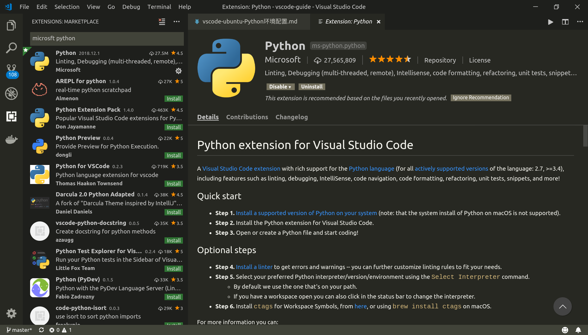
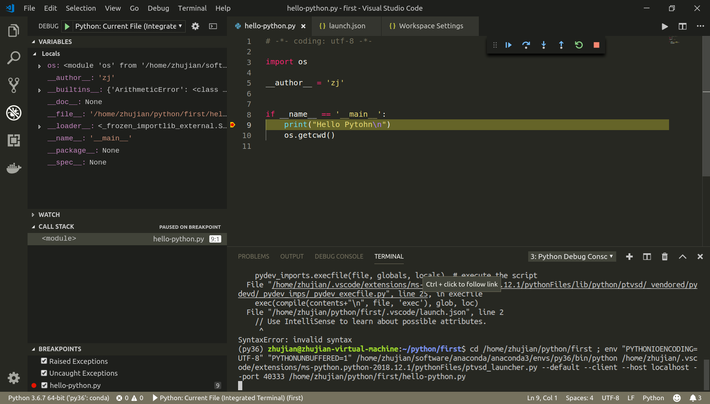

# Python环境配置

参考：

[Python in Visual Studio Code](https://code.visualstudio.com/docs/languages/python)

[Getting Started with Python in VS Code](https://code.visualstudio.com/docs/python/python-tutorial)

---

## 安装`Python`扩展+配置`Python`解释器

`Microsoft`提供了一个`Python`扩展组件，支持代码分析（`linting`）、调试、智能感知（`intellisense`）、代码导航、代码格式化、代码片段等等功能

另外，还需要进一步配置一个`Python`解释器（`Interpreter`），用于代码编译

### 安装`Python`扩展组件

使用`VSCode`打开一个空文件夹，首先安装`Python`扩展组件：

点击左侧活动栏扩展图标，搜索[microsft python](https://marketplace.visualstudio.com/items?itemName=ms-python.python)并安装

### 配置解释器

打开命令窗口（`Ctrl+Shift+P`），输入`Pytohn: Select Interpreter`，选择合适的解释器

配置完成后会在设置中找到

    "python.pythonPath": "/home/zhujian/software/anaconda/anaconda3/bin/python"

如果在命令窗口中没有搜索到想要的解释器，也可以直接修改属性`python.pythonPath`

---

## 构建代码

### `Hello Python`

执行完上述两步后，就可以进行`Python`编程了，编写一个简单的程序`first.py`

    # -*- coding: utf-8 -*-

    __author__ = 'zj'

    if __name__ == '__main__':
        print("Hello Pytohn\n")

点击鼠标右键->`Run Python File in Terminal`，就能看到执行结果

*也可以通过命令窗口执行*

设置快捷键：`Ctrl+Shift+B`

### 扩展组件

使用`Code Runner`也可以很容易进行`python`编译，安装完成后需要进一步设置

默认的执行`Python`程序是

    // Whether to run code in Integrated Terminal.
    "code-runner.runInTerminal": false,
    "code-runner.executorMap": {
        "python": "python -u",
    },

可以修改为内置终端执行，先激活环境再运行，同时禁止组件激活环境

    "code-runner.executorMap": {
        "python": "source activate py36 && python -u",
    },
    // Whether to run code in Integrated Terminal.
    "code-runner.runInTerminal": true,
    // Activate Python Environment in Terminal created using the Extension.
    "python.terminal.activateEnvironment": false

运行快捷键：`Ctrl+Shift+N`

---

#### 激活环境

`VSCode`默认每次运行时会先激活相应`Python`环境

    zhujian@zhujian-virtual-machine:~/python/first$ source activate py36
    /home/zhujian/software/anaconda/anaconda3/envs/py36/bin/python /home/zhujian/python/first/hello-python.py
    (py36) zhujian@zhujian-virtual-machine:~/python/first$ /home/zhujian/software/anaconda/anaconda3/envs/py36/bin/python /home/zhujian/python/first/hello-python.py
    Hello Pytohn

可通过系统属性`"python.terminal.activateEnvironment"`进行控制

---

## 智能感知和自动完成

安装好`Python`扩展后，就能实现智能感知（`IntelliSense`）和自动完成（`Autocomplete`），还可以定义一些属性

### 额外路径

如果需要引用安装在其他位置的`Python`文件，那么可以设置属性`"python.autoComplete.extraPaths"`

    // List of paths to libraries and the like that need to be imported by auto complete engine. E.g. when using Google App SDK, the paths are not in system path, hence need to be added into this list.
    "python.autoComplete.extraPaths": []

### 附加括号

如果你利用自动实现功能选择了一个函数，那么使用属性`python.autocomplete.addBrackets`（默认为`false`）可以自动添加括号

    // Automatically add brackets for functions.
    "python.autoComplete.addBrackets": false

---

## 代码格式化

参考：[Formatting](https://code.visualstudio.com/docs/python/editing#_formatting)

`Python`扩展支持代码格式化，默认使用`autopep8`，需要事先安装

    pip install pep8
    pip install --upgrade autopep8

### 格式化无法实现

参考：[autopep8 formatting on save doing nothing](https://github.com/Microsoft/vscode-python/issues/590)

安装好`autopep8`后，使用格式化快捷键没有效果，网上也没有很好的解决方案

找到一个办法就是设置属性`"editor.formatOnSave": true`，在保存后自动格式化

---

## 代码片段

参考：[VSCode代码片段](https://vscode-guide.readthedocs.io/zh_CN/latest/vscode-%E4%BB%A3%E7%A0%81%E7%89%87%E6%AE%B5.html)

---

## 调试

点击左侧活动栏调试图标，再点击配置图标（齿轮按钮），在`.vscode`文件夹内生成配置文件`launch.json`

    {
        // Use IntelliSense to learn about possible attributes.
        // Hover to view descriptions of existing attributes.
        // For more information, visit: https://go.microsoft.com/fwlink/?linkid=830387
        "version": "0.2.0",
        "configurations": [
            {
                "name": "Python: Current File (Integrated Terminal)",
                "type": "python",
                "request": "launch",
                "program": "${file}",
                "console": "integratedTerminal",
                "stopOnEntry":true
            },
            ...
            ...
            {
                "name": "Python: Current File (External Terminal)",
                "type": "python",
                "request": "launch",
                "program": "${file}",
                "console": "externalTerminal"
            }
        ]
    }

相应属性参考[Set configuration options](https://code.visualstudio.com/docs/python/debugging#_set-configuration-options)

不需要修改其中的配置，使用第一个`“Python: Current File (Integrated Terminal)”`即可

*属性`"stopOnEntry":true`可以让调试在进入程序第一步就停下*

#### 问题一：`SyntaxError: invalid syntax`

    (py36) zhujian@zhujian-virtual-machine:~/python/first$ cd /home/zhujian/python/first ; env "PYTHONIOENCODING=UTF-8" "PYTHONUNBUFFERED=1" /home/zhujian/software/anaconda/anaconda3/envs/py36/bin/python /home/zhujian/.vscode/extensions/ms-python.python-2018.12.1/pythonFiles/ptvsd_launcher.py --default --client --host localhost --port 45391 /home/zhujian/python/first/.vscode/launch.json
    Traceback (most recent call last):
        ...
        ...
        exec(compile(contents+"\n", file, 'exec'), glob, loc)
    File "/home/zhujian/python/first/.vscode/launch.json", line 2
        // Use IntelliSense to learn about possible attributes.
        ^
    SyntaxError: invalid syntax

调试时编辑窗口应该显示要调试的`Python`文件，否则会报错

#### 问题二：`Segmentation fault (core dumped)`

参考：

[Python debugger: Segmentation fault](https://github.com/Microsoft/vscode-python/issues/3528)

[Anaconda Python 环境查询，安装，卸载，克隆](https://blog.csdn.net/u012005313/article/details/82347817)

我使用`anaconda`默认的`Python`滑稽，但是无法进行调试，需要重新建一个环境

---

## Python配置

完整的`Python`配置如下：

    {
        "python.pythonPath": "/home/zhujian/software/anaconda/anaconda3/envs/py36/bin/python",
        "editor.formatOnSave": true,
        "python.autoComplete.addBrackets": true,
        "code-runner.executorMap": {
            "python": "source activate py36 && python -u",
        },
        // Whether to run code in Integrated Terminal.
        "code-runner.runInTerminal": true,
        // Activate Python Environment in Terminal created using the Extension.
        "python.terminal.activateEnvironment": false
    }
