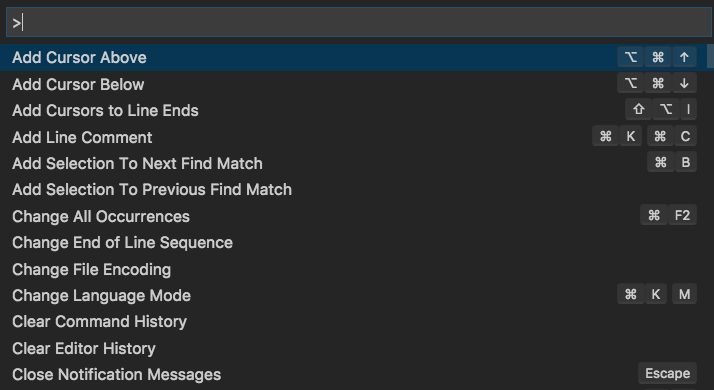
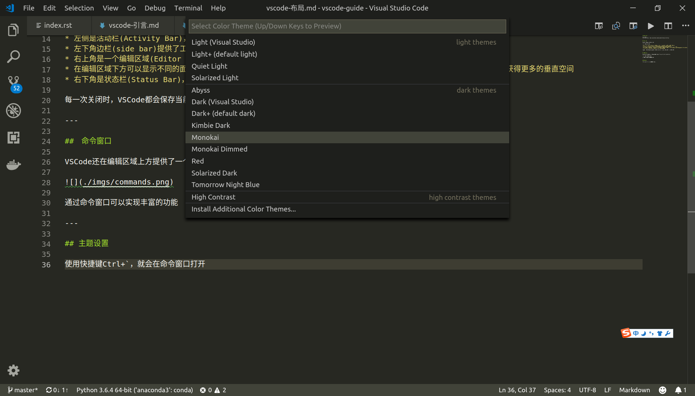

# 布局

参考：[User Interface](https://code.visualstudio.com/docs/getstarted/userinterface)

---

## 基本布局

`VSCode`提供了一个通用的窗口布局

* 左侧是活动栏(`Activity Bar`)，提供了文件栏、搜索栏、版本控制栏、调试栏、扩展栏和`Docker`
* 左下角边栏(`side bar`)提供了工程编辑信息，包括版本信息，语言信息和提示信息
* 右上角是一个编辑区域(`Editor Group`)，`VSCode`设计了编辑组的模式，可以水平或垂直打开多个编辑器
* 在编辑区域下方可以显示不同的面板(panel)，用于输出或调试信息、错误和警告，或者显示集成终端。面板也可以向右移动，以获得更多的垂直空间
* 右下角是状态栏(`Status Bar`)，显示打开项目和编辑文件的信息。

每一次关闭时，`VSCode`都会保存当前布局和编辑状态，等到下次打开时，会恢复到之前的状态。

---

##　命令窗口

`VSCode`还在编辑区域上方提供了一个命令窗口，通过快捷键`Ctrl+P/Ctrl+Shift+P`打开

通过命令窗口可以实现丰富的功能

---

## 主题设置

参考：[Color Themes](https://code.visualstudio.com/docs/getstarted/themes)

点击菜单栏`File > Preferences > Color Theme`，就会在命令窗口打开当前指定的主题，`VSCode`提供了多种主题

也可以通过快捷键Ctrl+`打开