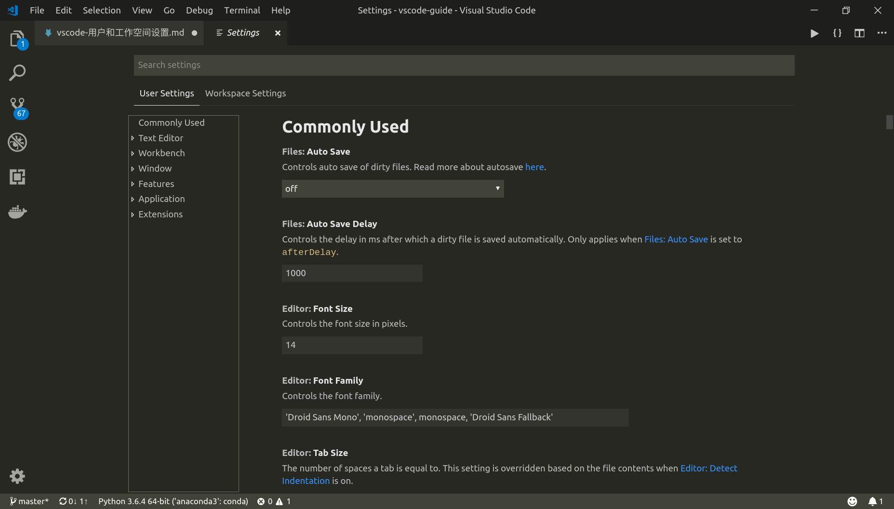

# 用户和工作空间设置

参考：[User and Workspace Settings](https://code.visualstudio.com/docs/getstarted/settings#_settings-editor)

---

## 概述

`VSCode`是一个轻量级的源码编辑器，它按照适用范围分为两种设置

* 用户设置(`user settings`)：其作用范围是`VSCode`的每一个实例
* 工作空间设置(`workspace settings`)：其作用范围是当前工作空间

可以通过图形界面进行配置，也可以通过配置文件进行编辑

**注意：工作空间设置会覆盖用户设置**

---

## 图形界面配置

点击菜单栏`File > Preferences > Settings`

或者打开命令窗口(`Ctrl+Shift+P`)，输入`settings`打开

可以根据需要切换用户设置和工作空间设置

---

## 配置文件

参考：[Settings file locations](https://code.visualstudio.com/docs/getstarted/settings#_settings-file-locations)

用户设置配置文件位置

    * Windows %APPDATA%\Code\User\settings.json
    * macOS $HOME/Library/Application Support/Code/User/settings.json
    * Linux $HOME/.config/Code/User/settings.json`

我的全局配置

    zhujian@zhujian-virtual-machine:~/.config/Code/User$ pwd
    /home/zhujian/.config/Code/User
    zhujian@zhujian-virtual-machine:~/.config/Code/User$ cat settings.json 
    {
        "python.pythonPath": "/home/zhujian/software/anaconda/anaconda3/bin/python",
        "window.zoomLevel": 2,
        "editor.wordWrap": "wordWrapColumn",
        "editor.wordWrapColumn": 80,
        "workbench.colorTheme": "Monokai"
        "window.openFilesInNewWindow": "on"
    }

工作空间配置文件在当前目录的`.vscode`文件夹内

---

## 默认设置

参考：[Default settings](https://code.visualstudio.com/docs/getstarted/settings#_default-settings)